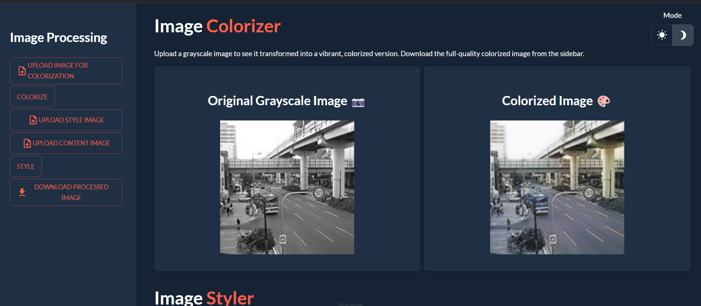

# SIC-DL-Project

## Overview

This project was developed as part of the Samsung Innovation Campus Machine Learning course. It implements a deep learning model for Colorization Gray Scale Images and add Style to them.

## Technologies Used

- Python
- TensorFlow/PyTorch
- Taipy

## NoteBook

The project is implemented in a Kaggle Notebook. It includes code for data preprocessing, model training, and image colorization.

Link to the notebook: [Colorization of Gray Scale Images](https://www.kaggle.com/code/mohamedelkhateb1/image-colorization-style-transfer-sic)
